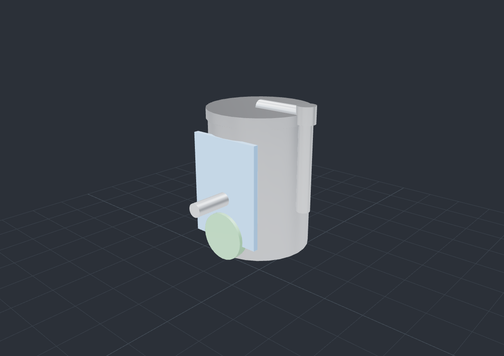
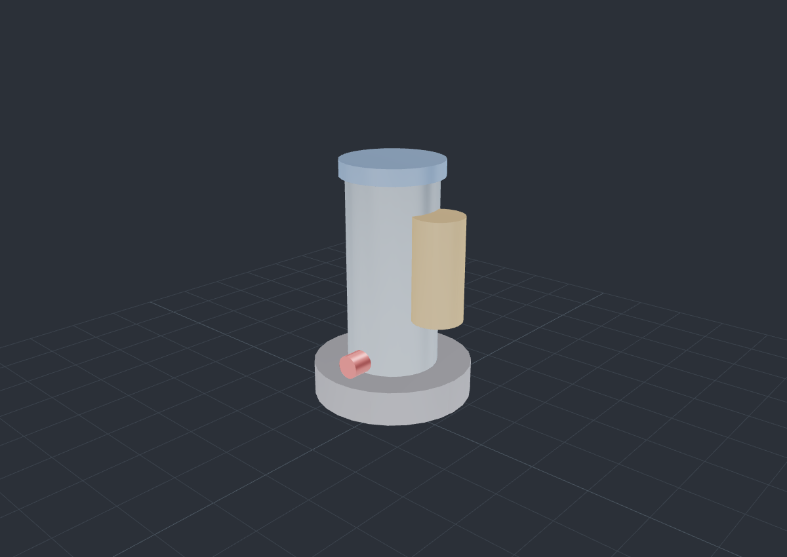

# 除害装置 3D 维护训练系统 / 除害装置 3D メンテナンス訓練システム

导入设备 3D 模型(glTF/GLB),按真实顺序逐步拆装演练,每步强制安全确认,可零风险反复练。
基于 **Build Spec v3.0**(C#/.NET 8 + WPF + HelixToolkit.Wpf.SharpDX v3 + SharpGLTF)实现。

> ⚠ 训练辅助,实际作业以官方程序为准 / 訓練補助。実際の作業は公式手順に従ってください。

---

## 解决方案结构

```
AbatementTrainer.sln
├─ src/AbatementTrainer.Core    类库(net8.0,与 UI 无关、可单测)——程序的灵魂
│   ├─ Models/                  数据契约(Manifest/Step/SafetyCheck…)、多语言
│   ├─ Serialization/           manifest.json 的 System.Text.Json 设置
│   ├─ Manifest/                M1 清单加载 + 校验 + glTF 节点检视(SharpGLTF)
│   ├─ Procedure/               M5 ProcedureRunner —— 安全门硬约束状态机
│   └─ Exam/                    M10 考核评分(打乱 + 排序比对)
├─ src/AbatementTrainer.App     WPF UI(net8.0-windows)——M2–M10 交互层
│   ├─ Services/                模型导入(Helix Assimp)、场景控制、本地化、内容索引
│   ├─ ViewModels/              MVVM(CommunityToolkit.Mvvm)
│   ├─ Resources/               .resx 多语言(zh / ja)
│   └─ MainWindow.xaml          视口 + 部件树 + 步骤/安全面板 + 考核覆盖层 + 免责横幅
├─ src/AbatementTrainer.Tools   控制台:glTF 节点检视 / 清单校验 / 生成示例模型
├─ tests/AbatementTrainer.Tests xUnit:Core 逻辑测试(68 项)
└─ content/                     设备库内容(index.json + unitA/unitB manifest + .glb)
```

**架构铁律:** 逻辑全部在 Core(可单测、可换引擎);App 只做 UI。安全门 `ProcedureRunner.CanAdvance`
是所有「下一步」路径的唯一闸口,代码层强制不可绕过。

---

## 已实现模块(对照 Build Spec)

| 模块 | 内容 | 状态 |
|------|------|------|
| M0 | 解决方案脚手架(4 项目 + 免责横幅) | ✅ |
| M1 | 清单加载 + 校验 + glTF 节点检视(SharpGLTF) | ✅(含单测) |
| M2 | Viewport3DX + Assimp 导入 + 灯光/相机 + 复位视角 | ✅ |
| M3 | 部件树 ↔ 3D 双向联动(列表选中高亮 / 点选 3D 反选) | ✅ |
| M4 | 显隐 / 隔离 / 全部显示 | ✅ |
| M5 | ProcedureRunner 安全门状态机(核心) | ✅(含单测) |
| M6 | 安全确认 UI + 步骤面板 + 门控「下一步」 | ✅ |
| M7 | remove 步骤平移取下动画(无 offset 退化为显隐) | ✅ |
| M8 | 中 / 日运行时切换(.resx + 清单文案) | ✅ |
| M9 | 设备库 / 内容索引(content/index.json) | ✅ |
| M10 | 考核模式(打乱 → 排序 → 评分) | ✅(评分逻辑含单测) |
| M11 | 自包含单文件发布 | 见下方命令 |

---

## 构建与运行

### 前置
- **.NET 8 SDK**
- WPF App **仅能在 Windows 上构建/运行**(`net8.0-windows` + DirectX 11 / SharpDX)。

### Core 与测试(任意平台,含 Linux/CI)
```bash
dotnet build src/AbatementTrainer.Core/AbatementTrainer.Core.csproj
dotnet test  tests/AbatementTrainer.Tests/AbatementTrainer.Tests.csproj
```

### 完整解决方案(Windows)
```powershell
dotnet build AbatementTrainer.sln -c Release
dotnet run --project src/AbatementTrainer.App
```

### 辅助工具(任意平台)
```bash
# 列出 glTF 节点名(核对部件命名约定)
dotnet run --project src/AbatementTrainer.Tools -- nodes content/unitA/models/unitA.glb
# 校验清单(可对照模型)
dotnet run --project src/AbatementTrainer.Tools -- validate content/unitA/manifest.json content/unitA/models/unitA.glb
# 生成示例演示模型(已随仓库提供 content/unitA/models/unitA.glb)
dotnet run --project src/AbatementTrainer.Tools -- gen-sample content/unitA/models/unitA.glb
```

### M11 · 打包发布(Windows,自包含单文件)
```powershell
dotnet publish src/AbatementTrainer.App -c Release -r win-x64 --self-contained true `
  -p:PublishSingleFile=true
```
产物可在无 .NET 运行时的 Windows 上双击运行;`content/` 随程序部署(csproj 已配置拷贝)。

---

## 数据契约(manifest.json)

字段名严格遵循 Build Spec §2,**不可更改**。示例见 `content/unitA/manifest.json`。
JSON 用 camelCase,枚举用字符串(大小写不敏感)。关键结构:

- `parts[].node` 必须对应 glTF 中存在的节点名(M1 校验项①)。
- `steps[].targetPart` 必须存在于 `parts[].id`(校验项②)。
- 所有 `name/title/instruction/text` 的 `zh` 与 `ja` 均非空(校验项④)。

启动加载设备时会先跑 `ManifestValidator`,**坏清单(如错误 node 名)会被拦截并在界面提示**。

---

## 3D 渲染示例

下面是 App 实际加载的同一批 `.glb`(示例设备)经 PBR + 环境光渲染的效果。
几何由 glTF 提供(架构「App 只加载、不造几何」),真实设备的管线/阀门细节取决于导入的模型。

| 除害装置 A 型(卧式,含进出口管线) | 除害装置 B 型(立式塔) |
|---|---|
|  |  |

> 注:示例模型为程序生成的圆柱+管线演示几何;Helix(DX11)与此渲染(WebGL)同为 PBR,
> Viewport3DX 已开启 MSAA/FXAA/SSAO + 三点布光,真实画面请在 Windows 上启动查看。

## 持续集成(CI)

`.github/workflows/ci.yml` 在每次推送时:
- **Linux job**:构建 Core/Tools 并运行 68 项 xUnit 测试。
- **Windows job**:构建完整 WPF App(`dotnet build`),实测渲染层代码可编译。

二者均为绿色(WPF App 已在 windows-latest 上成功编译)。

## 关于渲染层 API

Build Spec §6 要求「先核对 HelixToolkit.Wpf.SharpDX v3 实际 API,不要臆造签名」。
本仓库针对 **HelixToolkit v3.1.2**(`HelixToolkit.Wpf.SharpDX` / `HelixToolkit.SharpDX`
/ `HelixToolkit.SharpDX.Assimp` / `HelixToolkit.Maths`)逐一核对了实际程序集签名:
- 渲染核心类型在 `HelixToolkit.SharpDX.*`(v2 的 `*.Core.*` 已取消);
- v3 已弃用 SharpDX 数学库,`SceneNode.ModelMatrix` 为 `System.Numerics.Matrix4x4`;
- 模型动态内容经 XAML 中的 `SceneNodeGroupModel3D` 承载(Viewport3DX 无 ItemsSource);
- 节点高亮用 `SceneNode.AddPostEffect(new EffectAttributes("highlight"))` +
  视口内同名 `PostEffectMeshBorderHighlight`。

Windows CI job 已验证以上代码可成功编译。