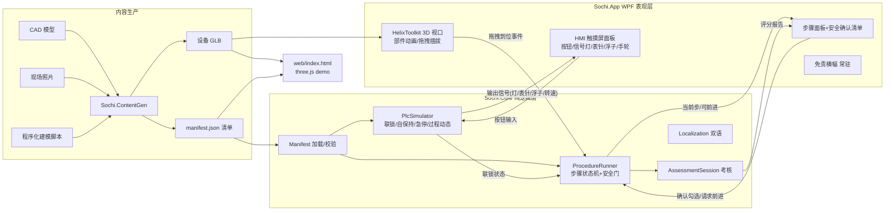
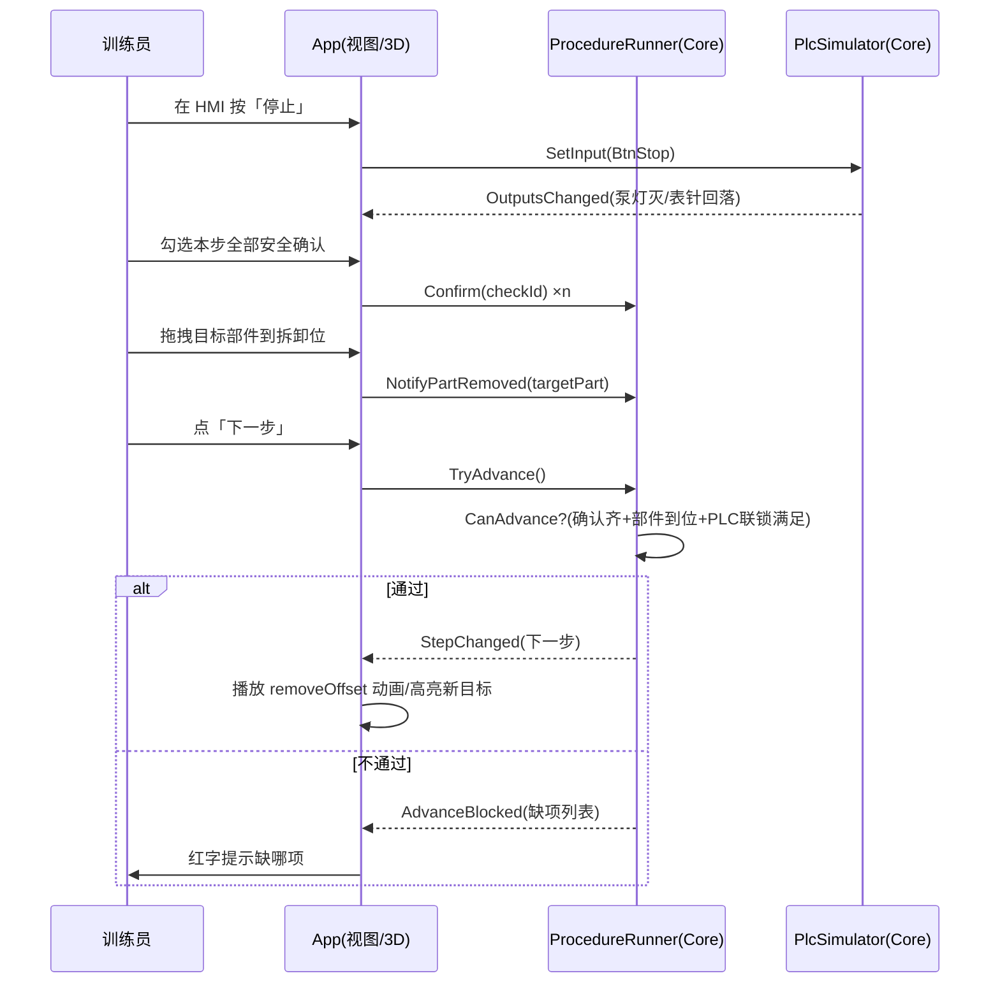
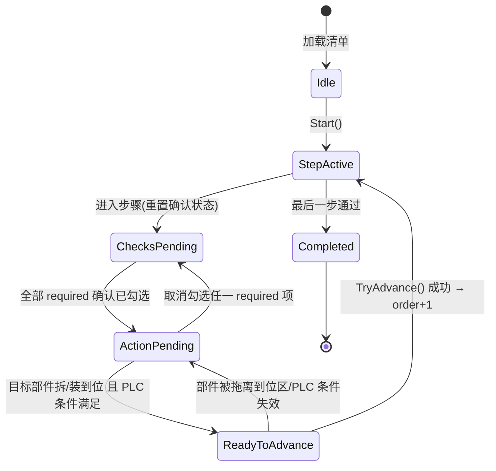
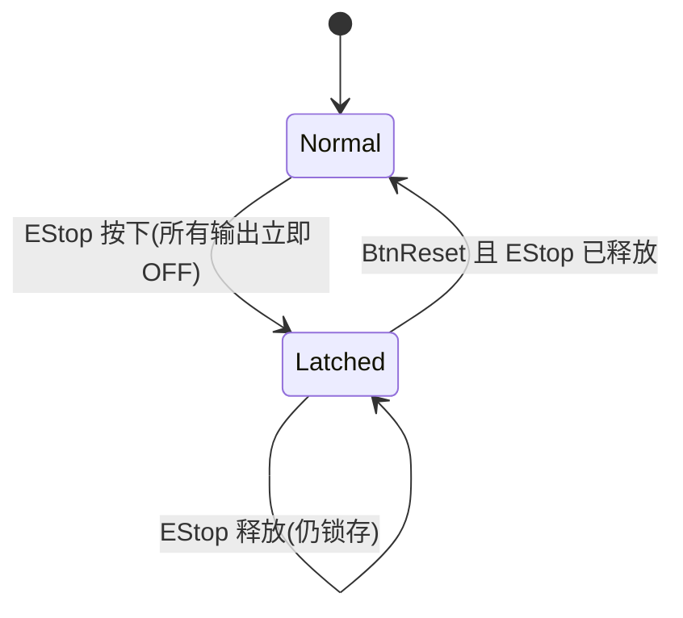
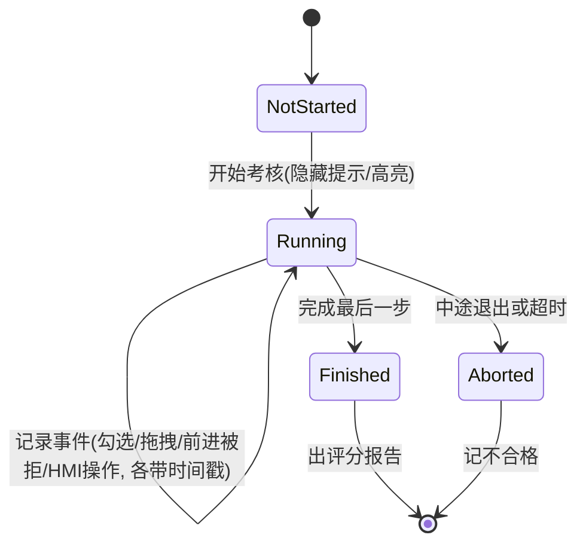

# 除害装置 3D 维护训练系统 — 系统设计书

- 文档编号:D1-SD-001
- 作者:设计代理 D1(系统架构师)
- 日期:2026-07-02
- 状态:初版(从需求出发全新设计;文末附与仓库现状的差异清单)

---

## 1. 需求陈述与验收目标

### 1.1 唯一目的

**通过程序就能模拟维护设备。**

即:不接触真实除害装置(半导体废气处理设备),仅凭本软件即可完成一次完整、可信、可考核的维护作业演练。所有其他功能(PLC 仿真、拖拽、双语、考核)都服务于这一目的。

### 1.2 需求分解

| 编号 | 需求 | 说明 |
|---|---|---|
| R1 | 模型导入 | 导入设备 3D 模型(glTF/GLB),按 glTF 节点名索引部件 |
| R2 | 顺序拆装 | 按真实作业顺序逐步拆卸/回装,顺序由清单 JSON 定义,不可跳步 |
| R3 | 安全确认 | 每步前进必须通过安全确认(勾选/输入等),**代码层不可绕过** |
| R4 | PLC 仿真 | HMI 触摸屏界面,按钮驱动设备内部运转:表针、浮子、信号灯、手轮;含联锁、自保持、急停锁存 |
| R5 | 拖拽插拔 | 全部件支持鼠标拖拽插拔,拆到位/装到位有吸附判定 |
| R6 | 考核模式 | 关闭提示,记录操作序列与用时,评分出报告 |
| R7 | 中日双语 | UI 与清单内容均可切换中/日 |
| R8 | 免责横幅 | 常驻显示「训练辅助,实际作业以官方程序为准」,不可关闭 |
| R9 | 双载体 | .NET 8 + WPF + HelixToolkit v3 桌面版为主;three.js 单 HTML 文件网页 demo 为辅,两者共用同一份清单 JSON 与 GLB |
| R10 | 内容生产 | 提供从 CAD、照片、程序化建模三条路线生成 GLB + 清单的管线(SharpGLTF + ImageSharp) |

### 1.3 验收目标(可判定)

- **A1(核心验收)**:新训练员在无真机、无纸质手册条件下,仅用本软件完成"泵体滤芯更换"级别的完整拆装流程,且每一步的安全确认与真实 SOP 一致。
- **A2**:任何 UI 操作路径(按钮、快捷键、拖拽完成自动推进)都无法在 `CanAdvance == false` 时使步骤前进;此约束有单元测试覆盖。
- **A3**:HMI 上执行「启动 → 运行中急停 → 复位 → 再启动」序列,PLC 状态机行为与梯形图语义一致(自保持、急停锁存需复位解除)。
- **A4**:考核模式产出包含每步用时、错序次数、安全确认漏项的评分报告。
- **A5**:语言切换即时生效,清单文本与 UI 文本均切换。
- **A6**:免责横幅在所有窗口/页面常驻,无隐藏入口。
- **A7**:`dotnet test` 全绿;`dotnet publish` 产出自包含单文件 exe,双击即用。
- **A8**:网页 demo 为单个 HTML 文件,双击本地打开即可演示同一台设备。

### 1.4 非目标(明确不做)

- 不做真实 PLC 通讯(OPC UA / Modbus)——仅软件内仿真。
- 不做物理仿真(碰撞、重力)——拆装用位移动画 + 吸附判定。
- 不做多人协同与网络服务端。
- 不替代官方作业程序(免责横幅即为此声明)。

---

## 2. 总体架构

### 2.1 分层原则(冻结项 4)

**逻辑在 Core(纯 .NET 类库,零 UI 依赖,可单测);App 只做 UI(WPF + HelixToolkit 渲染与输入)。**

判据:删掉 App 项目后,Core + Tests 仍可编译并全绿;任何业务规则(能否前进、PLC 扫描、评分)在 Core 内即可用单元测试验证。

### 2.2 项目/模块划分

```
solution/
├─ src/
│  ├─ Sochi.Core/                # 纯逻辑类库(net8.0,无 WPF 引用)
│  │  ├─ Manifest/               # 清单 JSON 模型 + 加载/校验(数据契约层)
│  │  ├─ Procedure/              # ProcedureRunner:步骤状态机 + 安全门
│  │  ├─ Plc/                    # PlcSimulator:扫描周期、联锁、自保持、急停锁存、过程动态
│  │  ├─ Assessment/             # 考核会话:记录、评分、报告
│  │  └─ Localization/           # 双语字典与语言切换
│  ├─ Sochi.App/                 # WPF 桌面(net8.0-windows)
│  │  ├─ Views/                  # 主窗口、HMI 面板、步骤面板、免责横幅
│  │  ├─ ViewModels/             # MVVM 绑定层(薄,转发到 Core)
│  │  └─ Rendering/              # HelixToolkit v3 场景、部件动画、拖拽插拔
│  └─ Sochi.ContentGen/          # 内容生成 CLI(SharpGLTF + ImageSharp)
├─ tests/
│  └─ Sochi.Core.Tests/          # xUnit 单元测试(安全门/PLC/评分/清单校验)
├─ content/                      # 设备包:*.glb + manifest.json + 纹理
├─ web/                          # three.js 单文件 demo(index.html,内嵌 JS)
└─ docs/
```

### 2.3 模块与数据流



要点:

- **单一数据源**:GLB + manifest.json 同时喂给桌面版和网页 demo,内容只做一次。
- **单向依赖**:App → Core;Core 不知道 App 存在。Core 通过事件(`StepChanged`、`OutputsChanged`)向外通知,App 订阅后更新视图。
- **PLC 与流程联动**:清单里的安全确认可声明依赖 PLC 状态(如"确认泵已停机"),`CanAdvance` 会查询 `PlcSimulator` 的实际状态,防止"嘴上确认、设备还在转"。

### 2.4 主循环时序(一步拆卸)



---

## 3. 数据契约(清单 JSON)

### 3.1 冻结字段(不可更改)

以下字段名与既有 glTF 节点名为冻结项,任何版本演进只能**新增可选字段**,不得改名/删除/变更语义:

`equipmentId` `name` `modelFile` `parts` `procedure` `steps` `order` `action` `targetPart` `removeOffset` `instruction` `safetyChecks` `type` `text` `required`

### 3.2 Schema 定义(v1 + 预留扩展)

```jsonc
{
  // ===== v1 冻结核心 =====
  "equipmentId": "scrubber-01",          // string, 必填, 设备唯一 ID
  "name": "除害装置(湿式スクラバー)",     // string, 必填, 设备显示名
  "modelFile": "scrubber-01.glb",        // string, 必填, 相对清单文件的 GLB 路径
  "parts": [                             // array, 必填, 可交互部件表
    {
      "id": "pump_cover",                // string, 必填 = glTF 节点名(冻结:节点名即部件 ID)
      "name": "泵盖",                     // string, 必填, 显示名
      "nameJa": "ポンプカバー"            // string, 可选扩展, 日文名(缺省回退 name)
    }
  ],
  "procedure": {                         // object, 必填, 维护流程
    "steps": [
      {
        "order": 1,                      // int, 必填, 从 1 连续递增(加载时校验)
        "action": "remove",              // string, 必填, 枚举: remove | install | inspect | operate
        "targetPart": "pump_cover",      // string, 必填, 引用 parts[].id(加载时校验存在)
        "removeOffset": [0, 0.25, 0],    // number[3], remove/install 必填, 拆出方向与距离(米)
        "instruction": "断电后拆下泵盖四颗螺栓", // string, 必填, 操作说明
        "instructionJa": "電源遮断後…",   // string, 可选扩展, 日文说明
        "safetyChecks": [                // array, 必填(可为空数组), 安全确认项
          {
            "type": "checkbox",          // string, 必填, 枚举: checkbox | confirmText(未来: plcCondition)
            "text": "已确认主电源断开并挂牌",  // string, 必填, 确认文案
            "textJa": "主電源遮断・タグ確認済", // string, 可选扩展
            "required": true             // bool, 必填, true=不勾不能前进
          }
        ]
      }
    ]
  },

  // ===== 预留扩展(全部可选;旧加载器按未知字段忽略,前向兼容)=====
  "schemaVersion": 1,                    // int, 缺省 1;加载器拒绝大于自身支持的版本
  "plc": {                               // PLC/HMI 仿真定义(缺省 = 无 HMI 面板)
    "inputs":  [ { "id": "BtnStart", "kind": "momentary", "label": "起動", "labelJa": "起動" } ],
    "outputs": [ { "id": "LampRun",  "kind": "lamp",  "bindNode": "lamp_run" },
                 { "id": "GaugeP1",  "kind": "gauge", "bindNode": "needle_p1", "min": 0, "max": 1.0, "unit": "MPa" },
                 { "id": "Float1",   "kind": "float", "bindNode": "float_ball", "travel": [0,0.12,0] },
                 { "id": "Wheel1",   "kind": "handwheel", "bindNode": "handwheel_v1" } ],
    "rungs":   [                         // 声明式梯级(v2 目标;v1 可由代码内置等价逻辑)
      { "out": "CoilRun", "expr": "(BtnStart || CoilRun) && !BtnStop && !EStopLatched" }
    ],
    "dynamics": [                        // 过程动态:一阶惯性把线圈状态变成连续量
      { "target": "GaugeP1", "follows": "CoilRun", "riseTimeSec": 3.0, "fallTimeSec": 5.0 }
    ]
  },
  "safetyChecks[].plcTag": "CoilRun==false", // 可选:确认项绑定 PLC 条件,勾选时软件校验实际状态
  "steps[].hints": ["先松对角螺栓"],          // 可选:练习模式提示(考核模式隐藏)
  "assessment": { "timeLimitSec": 600, "passScore": 80 } // 可选:考核参数
}
```

### 3.3 校验规则(加载时执行,失败给出行级中文错误)

1. 冻结必填字段缺失 → 拒绝加载。
2. `steps[].order` 必须 1..N 连续且唯一。
3. `targetPart` 必须存在于 `parts[].id`;`parts[].id` 必须能在 GLB 节点树中找到同名节点(加载模型后二次校验,缺失列出全部缺失名)。
4. `plc.rungs[].expr` 只允许 `&& || ! ()` 与已声明的 input/coil 名(白名单解析,防注入)。
5. 未知字段:忽略并 warning,不报错(前向兼容)。

---

## 4. 核心状态机设计

### 4.1 步骤安全门(ProcedureRunner)

**硬约束(冻结项 2):所有前进路径唯一入口为 `TryAdvance()`,其内部必查 `CanAdvance`;`CanAdvance` 为无副作用纯查询。不存在 `ForceAdvance`、不存在 internal 后门、不存在调试开关。**

```csharp
// Core/Procedure —— 关键接口(示意)
public sealed class ProcedureRunner
{
    public StepState CurrentState { get; }          // 见下方状态图
    public Step CurrentStep { get; }
    public bool CanAdvance { get; }                 // 纯查询:确认齐 && 部件到位 && PLC 条件满足
    public IReadOnlyList<string> BlockingReasons { get; } // 供 UI 显示缺哪项

    public void Confirm(int checkIndex);            // 勾选安全确认
    public void NotifyPartMoved(string partId, PartPosition pos); // 3D 层上报拆/装到位
    public bool TryAdvance();                       // 唯一前进入口;false=被安全门拦下
}
```



设计决定:

- **确认不跨步残留**:进入新步骤时清空全部勾选(防止"上一步勾过就带过来")。
- **可回退**:`GoBack()` 允许回到上一步复习,但回退后再前进仍需重新过安全门。
- **拆装到位判定在 App、裁决在 Core**:3D 层只上报几何事实(部件当前位移与 `removeOffset` 的接近度),是否"算到位"的阈值与裁决逻辑在 Core(可单测)。
- **PLC 联动确认**:带 `plcTag` 的确认项,勾选瞬间与 `TryAdvance` 时各校验一次 PLC 实态,不满足则拒绝并给出原因。

### 4.2 PLC 仿真(PlcSimulator)

模型:**固定扫描周期(默认 50ms)** 的软 PLC:读输入 → 求解梯级 → 更新锁存 → 推进过程动态 → 发布输出。全部逻辑在 Core,由 App 的 DispatcherTimer 驱动 `Scan(dt)`(测试中直接手动调 `Scan`,时间可控)。

四类语义:

1. **自保持(Self-holding)**:`Run = (BtnStart || Run) && !BtnStop && !Fault` —— 点动启动按钮松开后保持运行。
2. **联锁(Interlock)**:输出表达式引用其他线圈/输入,如"排风机未运行则药液泵不可启动":`PumpRun = (...) && FanRun`。
3. **急停锁存(E-Stop Latch)**:急停按下 → `EStopLatched = true` 且立即切断所有输出;松开急停**不**自动恢复,必须按「复位」且急停已释放才清除锁存:



4. **过程动态(Dynamics)**:线圈是 0/1,但表针/浮子/转速是连续量。用一阶惯性环节:`v += (target - v) * dt / τ`(τ 取 rise/fall 时间),使启动后压力表指针缓缓爬升、停机后缓缓回落、浮子随液位漂移——"设备内部在运转"的观感来自这里。手轮为双向输入:拖转手轮改变阀开度(0..1),开度作为 dynamics 的输入量。

输出绑定:每个 output 声明 `bindNode`(glTF 节点名),App 侧按 kind 映射:lamp→自发光材质开关、gauge→绕轴旋转(min/max 映射角度)、float→沿 travel 平移、handwheel→旋转且反向可拖。

### 4.3 考核会话(AssessmentSession)



- **只记录、不干预**:考核模式下安全门规则与练习模式完全一致(不放松也不加严),只是关闭提示并记录。
- 评分维度:总用时、每步用时、`TryAdvance` 被拒次数(错序/漏确认)、错拖部件次数;权重在 `assessment` 扩展字段配置,缺省内置。
- 报告输出:结构化对象(Core)→ App 渲染为可导出的文本/CSV。

### 4.4 双语(Localization)

- UI 字符串:Core 内 `zh`/`ja` 双字典,key 常量化;切换语言发 `LanguageChanged` 事件,ViewModel 重绑。
- 清单内容:`name/instruction/text` 为中文基准,`*Ja` 后缀字段为日文,缺失回退中文。**不改冻结字段,只加可选后缀字段。**

---

## 5. 内容生产管线(三路线)

目标:产出一对制品 —— `设备.glb`(节点名规范化)+ `manifest.json`(节点名与 parts 一致)。

| 路线 | 输入 | 工具链 | 适用 |
|---|---|---|---|
| A. CAD 转换 | STEP/IGES/SolidWorks | CAD → (Blender/FreeCAD) → glTF;ContentGen 做节点重命名、单位归一(米)、减面、合并材质 | 有厂商图纸时,精度最高 |
| B. 照片重建/贴图 | 现场照片 | ImageSharp 处理照片为 PBR 贴图(反照率/污渍),贴到程序化或 CAD 几何上;或摄影测量出网格再手工分件 | 无 CAD 但可到现场 |
| C. 程序化建模 | 尺寸参数 | SharpGLTF 用代码搭几何(圆柱/长方体/车削面组合出泵体、管路、表盘、手轮),ImageSharp 程序化生成刻度盘/标签贴图 | 无图纸无现场,demo 与占位内容;**当前主力路线** |

ContentGen CLI 职责(路线无关的公共出口):

1. **节点名规范化**:强制部件节点命名与 manifest `parts[].id` 一致(冻结的节点名不可再改)。
2. **一致性校验**:`contentgen validate <dir>` 检查 GLB 节点 ⊇ parts ⊇ 所有 targetPart/bindNode,CI 中运行。
3. **可动件预置**:表针/浮子/手轮建模时枢轴放在旋转/平移原点,便于运行时直接变换。
4. **清单脚手架**:`contentgen scaffold` 从 GLB 节点树生成 manifest 骨架,人工补 instruction 与 safetyChecks(安全文案必须人写,不自动生成)。

---

## 6. 非功能需求

### 6.1 性能

- 桌面:单设备 ≤ 20 万三角形、≤ 60 个可交互部件时,1080p 稳定 60 FPS;PLC 扫描 50ms 周期,单次 Scan < 1ms。
- 动画:拆装位移动画 300–500ms 缓动,主线程无 GC 卡顿(动画对象复用)。
- 加载:GLB + 清单冷加载 < 3s;网页 demo 单文件 < 15MB(GLB 可 Draco/内嵌 base64 二选一)。

### 6.2 可测试性

- Core 无 UI 依赖 ⇒ 安全门、PLC 时序(手动步进 `Scan(dt)`)、评分、清单校验全部 xUnit 覆盖。
- 必备测试清单:安全门穷举(缺任一 required 确认必拒)、自保持/联锁/急停锁存序列、order 乱序清单拒载、双语回退。
- 目标:Core 行覆盖 ≥ 80%,安全门与 PLC 模块 ≥ 95%。

### 6.3 CI

GitHub Actions(windows-latest):`restore → build (warnaserror) → test → contentgen validate content/ → publish 产物上传`。PR 必须全绿才可合并。

### 6.4 发布

- 桌面:`dotnet publish -r win-x64 -c Release --self-contained -p:PublishSingleFile=true`,单 exe + content 目录即整套交付,不装运行时。
- 网页 demo:`web/index.html` 单文件(three.js 内嵌或 CDN 注明离线限制),双击可开。
- 版本:SemVer;清单 `schemaVersion` 独立演进,加载器向后兼容 v1。

### 6.5 安全与合规

- 免责横幅「训练辅助,实际作业以官方程序为准」:主窗口顶部常驻控件,无关闭按钮,网页 demo 同样常驻(冻结项 3)。
- 清单来自本地文件,表达式解析用白名单词法,不 eval 任意代码。

---

## 7. 与现状的差异清单

(设计完成后浏览仓库目录与文件名所得快照,未读源码;每条给出建议:**采纳现状** 或 **按设计改造**)

现状概览:`src/AbatementTrainer.{Core,App,Tools}` + `tests/AbatementTrainer.Tests` + `content/unit{A,B,C}` + `docs/` + `.github/workflows/ci.yml`。Core 下已有 Manifest/Procedure/Plc/Exam/Models/Serialization;App 为 MVVM(ViewModels + Services + resx 双语资源);测试覆盖 Procedure/Plc/Exam/Manifest/Validator/Localization/ContentIntegration。总体分层与本设计高度一致。

| # | 差异 | 现状 | 本设计 | 建议 |
|---|---|---|---|---|
| 1 | 命名前缀 | `AbatementTrainer.*`;内容生成项目叫 `Tools`;考核模块叫 `Exam` | `Sochi.*` / `ContentGen` / `Assessment` | **采纳现状**:命名非本质,本书中 Sochi.Core→AbatementTrainer.Core、ContentGen→Tools、Assessment→Exam 一一对应,不改名 |
| 2 | 多设备内容库 | `content/index.json` + unitA/B/C 三套设备包(manifest.json + models/*.glb),App 侧有 ContentLibraryService | 设计只定义单设备清单契约,未定义库索引 | **采纳现状**:将 index.json 作为伴生契约补入 §3(设备列表索引,字段同样走"只增不改"原则) |
| 3 | 网页 demo 位置与数量 | `docs/webdemo/unitC-web.html`、`unitC-demo.html`(仅 unitC,两个文件) | `web/index.html` 单文件、与桌面共用同一 content/ 数据源 | **按设计改造(轻量)**:位置可保留 docs/webdemo,但应收敛为每设备一个入口,并确保其内嵌数据与 content/unitX 同源生成(由 Tools 生成,防手工分叉) |
| 4 | 双语实现位置 | App 用 WPF 标准 resx(Strings/zh/ja)+ LocalizationService;Core 仅 Models/Language.cs | 双语字典放 Core/Localization | **采纳现状**:UI 串用 resx 是 WPF 惯例;仅要求"清单文本双语回退"逻辑留在 Core 可单测,不把 resx 搬进 Core |
| 5 | HMI 面板视图 | 未见独立 HMI/面板 View 文件(推测 HMI 嵌在 MainWindow.xaml 内,仅有 PlcViewModel) | HMI 为独立面板视图(§2.2 Views/) | **按设计改造(可缓)**:MainWindow 膨胀时拆出 HmiPanel 用户控件;逻辑不变,纯视图整理 |
| 6 | PLC 定义方式 | 已有 Core/Plc/PlcSimulator.cs + PlcSimulatorTests(语义覆盖度未读源码不可判) | 清单 `plc` 扩展字段声明式定义(inputs/outputs/rungs/dynamics)+ 急停锁存/自保持/联锁/过程动态四语义(§4.2) | **按设计改造(增量)**:保留现有模拟器,对照 §4.2 补齐缺失语义与"确认项绑定 plcTag"联动;逐步把设备差异从代码迁到清单 plc 字段 |
| 7 | Tools 子命令 | Tools 含 Program.cs/SampleModelBuilder/ProceduralTextures(程序化路线 C 已落地);未见 validate/scaffold 命令痕迹 | ContentGen 提供 `validate`(接入 CI)与 `scaffold` 子命令(§5) | **按设计改造(优先 validate)**:Core 已有 ManifestValidator/GltfInspector,只需在 Tools 加 CLI 出口并挂进 CI;scaffold 低优先 |
| 8 | 内容一致性校验在 CI 的形态 | 已有 ci.yml 与 ContentIntegrationTests(推测以测试形式校验 content/) | CI 独立 `contentgen validate content/` 步骤 | **采纳现状**:用集成测试校验内容与独立 CLI 等效,且随 dotnet test 自动执行;CLI 校验降为可选 |
| 9 | 设计文档基线 | docs/ 下为 RESEARCH.md、ui-mockup.svg、renders 渲染图,此前无系统设计书 | 本书(docs/design/SYSTEM_DESIGN.md)为设计基线 | **按设计改造**:以本书为设计基线;与 RESEARCH.md 冲突处以冻结项与本书为准 |

结论:现状架构(Core/App/Tools/Tests 分层、content 独立、CI 已建、PLC/考核/双语均有落点)与本设计同构,**无需结构性重构**;差异集中在"声明式 PLC 清单化(#6)、web demo 与内容同源(#3)、validate CLI(#7)"三个增量点。冻结项(数据契约字段、CanAdvance 安全门、免责横幅、Core/App 分层)在任何改造中不可动。
